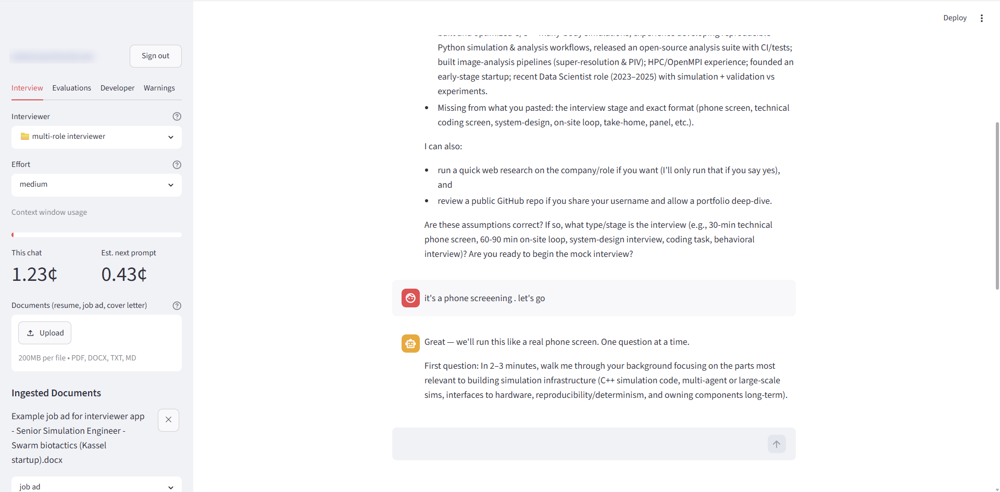

# Interview Prep

**A mock-interview chatbot that reads your actual resume, your actual job ad, and your actual GitHub — then interviews you on them and scores every answer.**

Most interview practice is generic. This one asks about the gap between the role you want and the resume you have, probes the project you shipped last year, and tells you where your answer was weak and why.

<!-- Once deployed, add the link and a screenshot or two here — a portfolio README earns
     far more from one image of a scored answer than from another paragraph:
      -->

## What a session looks like

1. **Drop in your documents.** Resume, job ad, cover letter — PDF, DOCX, TXT or MD. Or skip it and answer a few intake questions instead; uploading is an accelerator, never a gate.
2. **Get interviewed.** One question at a time, in role, with follow-ups that pick at the things you glossed over.
3. **Get scored.** Every answer is rated on six dimensions — relevance, structure, specificity, evidence, judgment, communication — with written feedback on what would have made it stronger.
4. **Compare at a glance.** Each scored answer becomes a card in the **Evaluations** tab, with running per-dimension averages, so you can see whether you are actually improving across the session or just talking more.

## What it can draw on

**Your documents.** Uploaded files are parsed, safety-screened, chunked and embedded, then retrieved per turn — so questions come from *your* projects and probe gaps between *your* resume and *the* job ad. The **Last Retrieval** panel shows exactly which excerpts an answer was grounded in.

**The web, when you ask.** Ask about the company's recent news, current tooling for the role, or salary data and the interviewer will research it — returning cited bullets with clickable sources. **It never searches on its own**: only when you ask, or after you say yes to its offer.

**Your GitHub.** Share a username and it will read your public repositories — READMEs and real code — then ask interview questions about work you actually did. It offers first and browses only with your say-so.

**A curated coaching knowledge base.** Interview best practice, question banks tagged by role and seniority, competency expectations, bias-reduction guidance, and the legal limits on what an interviewer may ask. These shape the questions and the scoring, and they persist across sessions.

**Interviewers you can swap or write.** The interviewer's entire personality and rubric live in markdown under `prompts/`, not in code. Pick a different one from the sidebar, or drop in your own file — it appears in the selector on the next run with no code change.

---

# Under the hood

The interesting part of this project is not the chat loop. It is what had to be true for the chat loop to be trustworthy.

## Stack

**Python 3.12** · **Streamlit** (UI + native OIDC) · **LangChain / LangGraph** (`create_agent`, custom middleware) · **OpenRouter** for all model traffic · **Postgres** (Supabase) for the spend ledger · **SQLite** for the derived knowledge-base cache · **MCP** for the GitHub integration · **uv** for dependencies · **pytest** + **DeepEval**.

`chat_bot.py` is a thin entry point; everything else is single-job modules in `interview_prep/`. See [`docs/diagrams/architecture.md`](docs/diagrams/architecture.md) for the chat-turn, tool-turn, ingestion and module-map diagrams — including the agent's graph, **generated from the compiled object** rather than drawn, so it shows what was built instead of what was intended.

## Three questions before a model call

A visitor passes three independent gates, each its own module, because they fail in different directions and collapsing them would make *"nobody signed in"* and *"signed in with a small budget"* the same state.

| Question | Mechanism |
|---|---|
| **Who are you?** | Google OIDC via Streamlit's native `st.login` — the app never handles a credential |
| **May you be here?** | An explicit allowlist in secrets. Presence is authorization; **absence is refusal** |
| **How much may you spend?** | A per-identity lifetime cap in Postgres, checked before the turn and recorded after |

Signing in proves an email address and nothing more — every Google account holder on earth can do it — while every turn spends the operator's own credit. So identity and authorization are separate decisions, and the second is an allowlist rather than a property of the first.

## Ideas the code is organised around

**Guards belong to the operation, not the caller.** A refusal in the page protects the page. This app has three entry points — the UI, `evals/`, and the test suite — and the latter two reach the paid clients directly. So authorization and the spend cap are enforced *inside each of the six clients that spend money*, and a [mechanical test](tests/test_spend_is_guarded.py) pins that across all six so a seventh cannot quietly ship without one.

**Fail closed, and say which way the uncertainty leaks.** An unreadable allowlist authorizes nobody — including the operator. An unreachable ledger refuses every turn. Both are expensive defaults chosen deliberately: a deployment serving no one is fixed in minutes, while one silently admitting the world to a funded API key produces no error and a bill.

**Count what you spend, or you are not counting.** Six clients spend money here. Four of them — the safety guardrail, the query condenser, and two embedding paths — historically reported nothing at all, so any cap built on the other two would have looked healthy while counting a third of the bill. Closing that was most of the work behind the spend cap, and the recurring theme of the project: **a control that reports success without holding is worse than no control.**

**Behavior lives in markdown.** Changing how the interviewer behaves must never require a Python change. The prompts are composed from files, with a `{retrieved_context}` contract that lets a prompt opt into RAG by containing a placeholder.

**Tools screen nothing.** Every tool reports what it got; middleware decides what the model may see. That makes screening impossible for a new tool to forget — it is no longer something a tool does.

**Untrusted content stays untrusted.** Uploaded documents, web results and repository files are all prompt-injection vectors. Each is scanned in overlapping windows by a larger classifier before the interviewer sees it, and a document that cannot be scanned is rejected rather than admitted.

**Models invent things, so claims get checked.** A model that failed to read a repository has been observed inventing plausible file names instead of saying so. Every identifier the tools actually returned is remembered, and a reply naming a file that never appeared raises a warning.

## Testing

`uv run pytest` — 600 tests, 85% coverage. The parts worth mentioning:

- **Coverage is read as a blind-spot detector, not a target.** Where tests inject fakes, the construction of the real client may never execute in any test — and nothing announces that.
- **Fault seeding.** A defect is seeded into a *copy* of a module to check that exactly the right test fails. A verification tool that has never been shown to fail is not yet evidence.
- **Mechanical tables over samples.** Guards are pinned per-client with a count assertion, so an omission fails the suite instead of being absent from a list nobody rereads.
- **Prompt evaluation** (`evals/`) scores the real composed prompt with LLM-as-a-judge metrics, so a prompt edit can be measured rather than eyeballed.

## Decision records

`docs/decisions/` holds the ADRs — what was chosen, and the cost knowingly accepted. The ones worth reading on their own:

- [**0210 — A hosted Postgres ledger, and why it is not the best answer**](docs/decisions/0210-hosted-postgres-ledger-for-the-spend-cap.md). Records plainly that OpenRouter's provisioned per-user keys are the better mechanism, and why this one was chosen anyway.
- [**0200 — Authentication is OIDC plus an explicit allowlist**](docs/decisions/0200-authentication-is-oidc-plus-an-explicit-allowlist.md). Why proving identity does not answer whether to serve someone.
- [**0150 — Screen tool results by default**](docs/decisions/0150-screen-tool-results-by-default.md). Moving screening out of tools and into middleware.
- [**0110 — Knowledge-base seeds in git**](docs/decisions/0110-sqlite-knowledgebase-seeds-in-git.md), and the note where the spend cap narrowed its "no database ever needs hosting" claim rather than quietly abandoning it.

`docs/REQUIREMENTS.md` is the behavioural spec, written so the app could be reimplemented from it.

## An experiment that shipped with the feature

The spend cap was also the arena for a controlled comparison of two agent-orchestration styles building the *same* work package from the *same* committed brief, in isolated worktrees: a **13-agent dynamic workflow** against **two named teammates with an auditor**.

Both reached a confident "done" within three minutes of each other. Everything that distinguished them happened afterwards — one spent 77% of its elapsed time being audited and knew what was wrong with its own output; the other produced a comparable artifact and no insight into it. Measures were fixed before either ran, and two of six are reported as unusable rather than quietly dropped.

Written up in [`docs/experiments/harness-comparison/`](docs/experiments/harness-comparison/).

---

# Running it yourself

Requires **Python 3.12** and [uv](https://docs.astral.sh/uv/).

```bash
cp .env.example .env      # then set OPENROUTER_API_KEY — https://openrouter.ai/keys
uv sync
uv run streamlit run chat_bot.py
```

Then open <http://localhost:8501>.

Optionally set `GITHUB_PAT` in the same `.env` (a [fine-grained token](https://github.com/settings/personal-access-tokens) with read-only access to public repos) to enable the GitHub deep-dive. Without it the app runs normally, minus that feature.

## Configuring access and the spend cap

**The app serves nobody until this is done** — not even you. That is deliberate, not a rough edge.

```bash
cp .streamlit/secrets.toml.example .streamlit/secrets.toml   # then edit it
```

The template documents every field and the traps that cost real time. In short, three blocks:

- **`[auth]`** — your OIDC client (for Google: a *Web application* OAuth 2.0 Client ID). The `redirect_uri` must match the provider's registration **exactly** and differs between local and deployed; a drifted value fails at the provider, with nothing the app can explain.
- **`[roles]`** — the allowlist, mapping authorized email → `dev` or `user`. A `dev` also sees the Developer and Warnings tabs. **List your own address; you are not exempt.**
- **`[spend]`** — a Postgres connection string (use the **transaction pooler**, port 6543) and the per-identity `cap_usd`. Create the table:

  ```sql
  create table spend (
    email      text primary key,
    total_usd  numeric(18, 12) not null default 0,
    updated_at timestamptz     not null default now()
  );
  ```

  Twelve decimal places, not six: a single query embedding costs about $0.0000008, and at lower precision the two embedding paths would record zero on every retrieval — the cap defeated in the schema after being fixed in the code.

> **Never commit `.streamlit/secrets.toml`.** It holds a live client secret, your cookie signing key and a database password. Only the `.example` template belongs in git.

## Deploying

[`docs/DEPLOYMENT.md`](docs/DEPLOYMENT.md) covers Streamlit Community Cloud end to end: the settings that cannot be changed after the first deploy, the TOML ordering that decides whether your API key is found at all, the `redirect_uri` chicken-and-egg with Google, and what a container recycle does and does not reset.

Two things to know going in: **the free Supabase tier pauses after 7 days idle**, and because the cap fails closed, a paused database means the app serves nobody until it is woken. And the **spend ledger is the one thing that survives a recycle** — which is the entire reason it is not a local file.

## Prompt evaluation

`evals/` is standalone — the app never imports it. It loads the *real* composed prompt, runs it against interview scenarios, and judges the replies with [DeepEval](https://deepeval.com) over OpenRouter.

```bash
uv run python -m evals                    # score the current prompt, print a report
uv run python -m evals --limit 3          # cheaper smoke run
uv run python -m evals --fail-under 0.7   # non-zero exit for CI
```

Six metrics per scenario: `answer_relevancy` plus custom `GEval` rubrics — `asks_one_question`, `actionable_feedback`, `refuses_fabrication`, `stays_on_scope`, and `behavior_rules`, which is built dynamically from the rules the markdown itself lists. Edit a prompt, re-run, see whether it helped.

## Writing your own interviewer

Drop a `.md` file or a folder of them into `prompts/`. Conventions:

- Files in a folder concatenate by **leading number** (`10_…`, `20_…`). Gap numbering leaves room to insert `15_…` later without renumbering.
- A file ending **`.ignore.md`** is hidden from the selector (used for non-persona prompts like the guardrail classifier).
- A prompt containing **`{retrieved_context}`** is *grounding-aware*: retrieved excerpts are injected there each turn, and it is offered tools. Prompts without it behave as though RAG did not exist.
