# Architecture

> **Viewing this diagram:** in VS Code, install the **"Markdown Preview Mermaid
> Support"** extension (publisher `bierner`), then open this file and press

```mermaid
flowchart TB
    user([User / Interviewee])

    subgraph app["Streamlit app — chat_bot.py (entry point)"]
        direction TB
        keycheck["Load API key<br/>load_api_key / render_api_key_input"]
        chatloop["Chat loop:<br/>guard → append → rerun → stream → cost"]
    end

    subgraph pkg["interview_prep package"]
        direction TB
        config["config.py<br/>constants + paths"]
        prompts["prompts.py<br/>discover / load / compose markdown"]
        guardrails["guardrails.py<br/>JailbreakGuard (pre-send, fails open)"]
        llm["llm.py<br/>InterviewLLM (streaming client)"]
        pricing["pricing.py<br/>cost accounting"]
        context["context.py<br/>tokens + context window"]
        ui["ui.py<br/>sidebar + history"]
    end

    subgraph md["prompts/ (behavior in markdown)"]
        direction TB
        multi["multi-role interviewer/<br/>10 main · 20 intake · 30 interview · 40 feedback"]
        simple["simple_interviewer.md (zero-shot)"]
        fewshot["few-shot_interviewer.md"]
        guardmd["guardrail.ignore.md (classifier)"]
    end

    subgraph evals["evals/ — standalone LLM-as-a-judge (app never imports)"]
        direction TB
        runner["runner.py evaluate_prompt"]
        judge["judge.py OpenRouterJudge + AppUnderTest"]
        metrics["metrics.py — 6 DeepEval metrics"]
        dataset["dataset.py — scenarios"]
    end

    orouter["OpenRouter API<br/>/chat/completions · /models"]

    user -->|prompt| chatloop
    chatloop -->|load key| keycheck
    chatloop -->|screen input| guardrails
    chatloop -->|compose prompt| prompts
    chatloop -->|stream reply| llm
    chatloop -->|render UI| ui
    ui --> pricing
    ui --> context

    prompts --> md
    guardrails --> guardmd
    guardrails -.guard model.-> orouter
    llm -.gpt-5-mini stream.-> orouter
    pricing -.pricing.-> orouter
    context -.model catalog.-> orouter
    llm -->|streamed reply| user

    runner --> prompts
    runner --> judge
    runner --> metrics
    runner --> dataset
    judge -.judge model.-> orouter

    classDef ext fill:#f9e0c3,stroke:#b5651d,color:#000
    classDef mdfile fill:#dfeef7,stroke:#2b6a8f,color:#000
    class orouter ext
    class multi,simple,fewshot,guardmd mdfile
```

> `Ctrl+Shift+V`. Or paste the code block into <https://mermaid.live>.

## Legend

- **Solid arrows** = in-process calls between Python modules.
- **Dotted arrows** = network calls to the **OpenRouter API** (orange).
- **Blue boxes** = markdown prompt files — the interviewer's behavior lives here,
  not in Python.

## How to read it (top → bottom)

1. A user prompt enters the chat loop in `chat_bot.py`.
2. The loop first runs the **guardrail** (a pre-send jailbreak/injection check
   that *fails open*), then composes the **system prompt** via `prompts.py`,
   which reads the markdown under `prompts/`.
3. `llm.py` streams the reply from OpenRouter (`gpt-5-mini`); `ui.py` renders the
   sidebar, using `pricing.py` and `context.py` (both also hit `/models`).
4. The **`evals/` box is intentionally detached** — the LLM-as-a-judge harness
   reuses the same prompt-loading code but is never imported by the running app.
