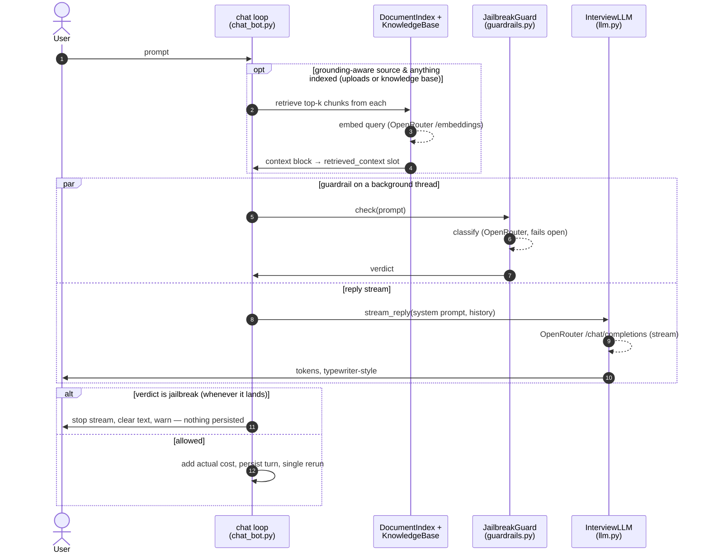
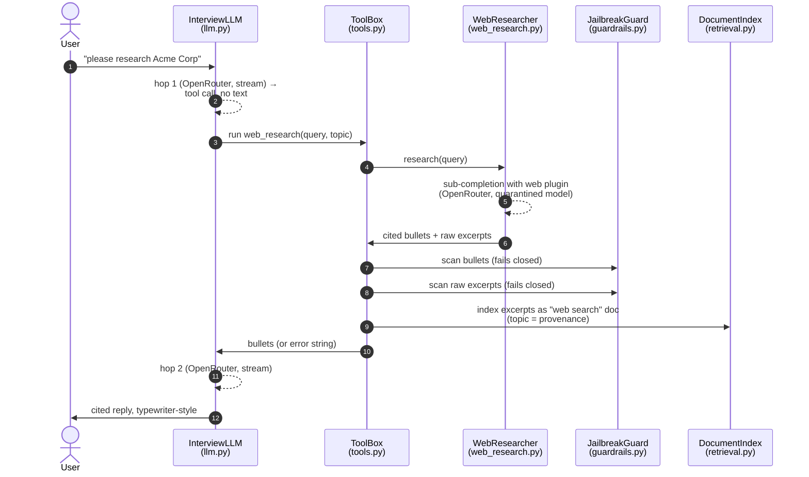
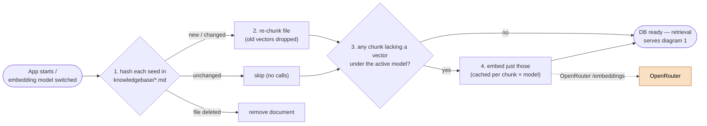
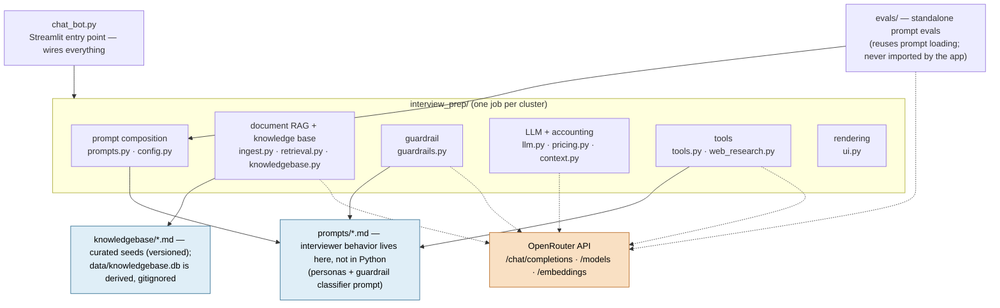

# Architecture

> **Viewing these diagrams:** in VS Code, install the **"Markdown Preview Mermaid
> Support"** extension (publisher `bierner`), then open this file and press
> `Ctrl+Shift+V`. Or paste a code block into <https://mermaid.live>.
>
> Diagrams here follow the principles in [`DIAGRAMS.md`](DIAGRAMS.md): one story
> per diagram, sequence diagrams for temporal flows, ~7±2 boxes each.

Five views, from most dynamic to most static. Shared conventions: **dotted
arrows** = network calls to OpenRouter, **solid arrows** = in-process;
**orange** = external API, **blue** = markdown prompt files.

## 1. A chat turn

*What happens between the user pressing Enter and the reply being saved?*

Key points: retrieval happens *before* the stream; the guardrail runs
*concurrently with* the stream and is polled between tokens; the sidebar
refreshes only on the rerun after the turn completes.

## 2. A web-research turn

*What happens when the user asks the interviewer to research something?* (The
guardrail-vs-stream concurrency and the persist/rerun ending are as in
diagram 1 — this diagram tells only the tool story.)

Key points: the interviewer never sees raw web pages — only the sub-call's
screened bullets (dual-LLM quarantine; ADR-0100); both scans fail **closed**
like document ingestion; the indexed excerpts let diagram 1's retrieval serve
follow-up turns without a new search.

## 3. Document ingestion

*What happens when the user drops a file into the sidebar?*

Note the polarity: this scan **fails closed** per document (no clean scan → no
ingestion), the opposite of the per-turn chat guardrail, which fails open so a
classifier outage never blocks the conversation.

## 4. Knowledge-base startup sync

*How does the persistent knowledge base stay in step with its seed files?*
(Runs once per session, and again when the embedding model changes.)

Key points: the seeds in git are the source of truth and `data/knowledgebase.db`
is a derived artifact (delete it and it rebuilds); a warm start makes zero
network calls; switching back to a previously used embedding model re-embeds
nothing (ADR-0110).

## 5. Module map

*What are the parts, and what depends on what?* Static structure only — no
runtime edges (those are diagrams 1–3).

The full module-by-module list (what each file exports) lives in
[`CLAUDE.md`](../../CLAUDE.md) and the [`README`](../../README.md) — inventories read
better as text than as boxes.
