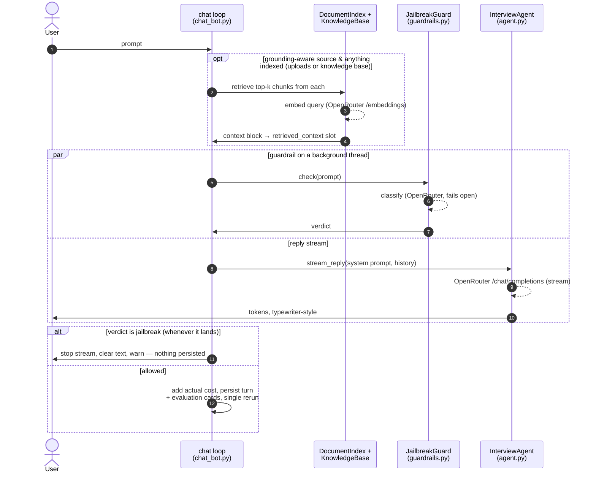
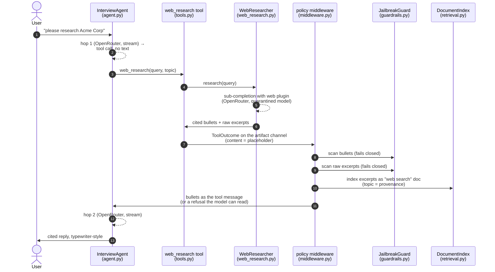
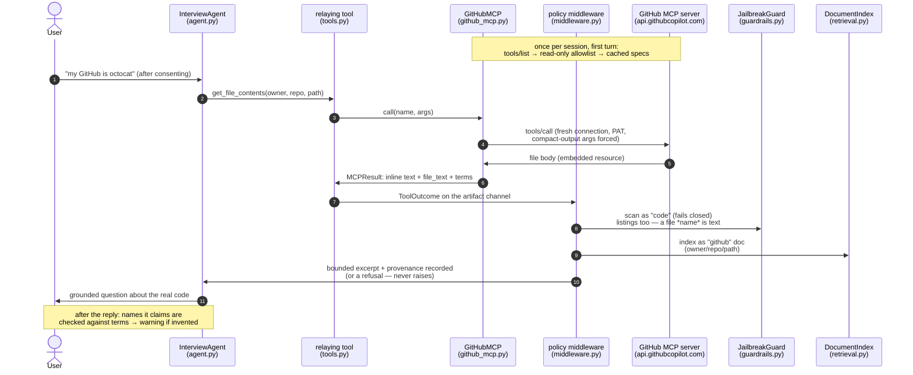
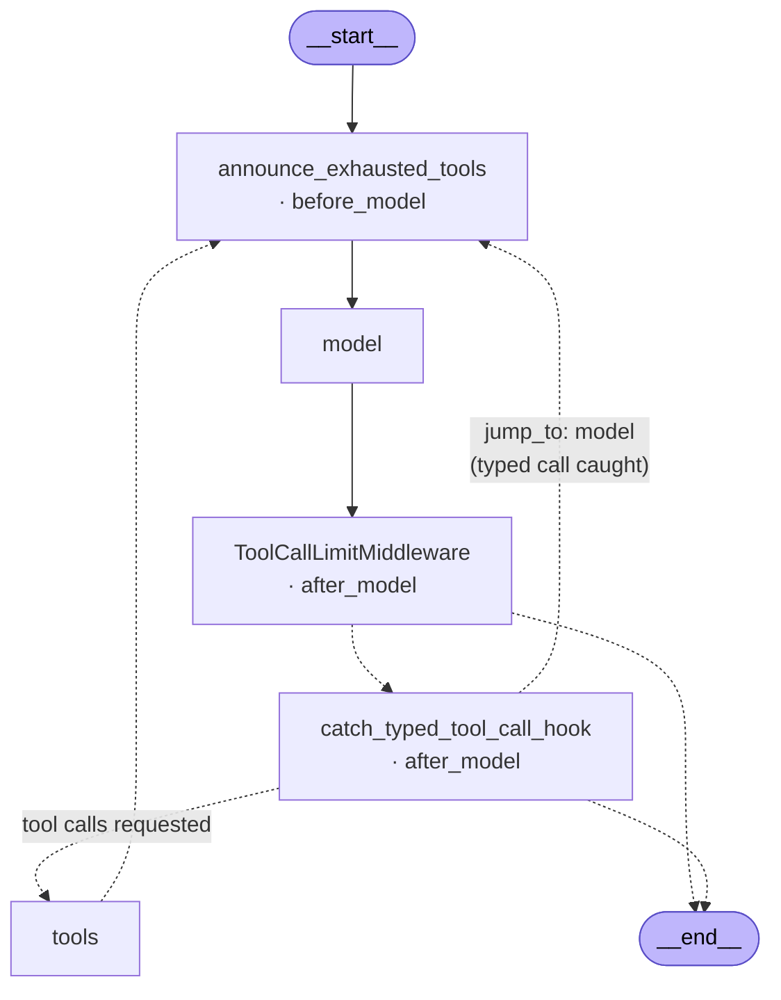
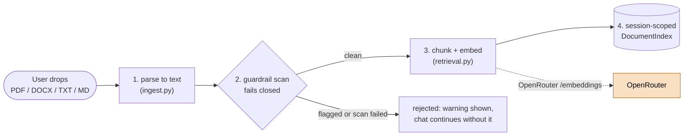
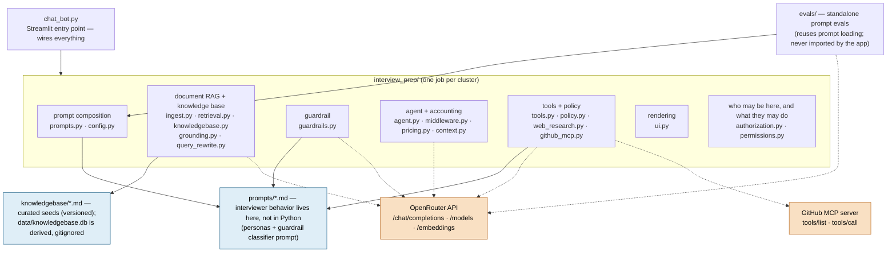

# Architecture

> **Viewing these diagrams:** in VS Code, install the **"Markdown Preview Mermaid
> Support"** extension (publisher `bierner`), then open this file and press
> `Ctrl+Shift+V`. Or paste a code block into <https://mermaid.live>.
>
> Diagrams here follow the principles in [`DIAGRAMS.md`](DIAGRAMS.md): one story
> per diagram, sequence diagrams for temporal flows, ~7±2 boxes each.
>
> **Note:** these diagrams are automatically AI-generated and only lightly
> reviewed — when a detail matters, verify it against the code.

Seven views, from most dynamic to most static. Shared conventions: **dotted
arrows** = network calls to an external API, **solid arrows** = in-process;
**orange** = external API, **blue** = markdown prompt files. (Diagram 4 is a
graph rather than a flow, and uses dotted arrows for conditional edges.)

## 1. A chat turn

*What happens between the user pressing Enter and the reply being saved?*



Key points: retrieval happens *before* the stream; the guardrail runs
*concurrently with* the stream and is polled between tokens; the sidebar
refreshes only on the rerun after the turn completes.

## 2. A tool-calling turn (web research shown)

*What happens when the interviewer calls a tool mid-turn?* (The
guardrail-vs-stream concurrency and the persist/rerun ending are as in
diagram 1 — this diagram tells only the tool story.) The hop loop is the same
for every tool; `web_research` is drawn because it has the richest flow. The
other tool, `record_evaluation` (ADR-0120), follows the same shape with steps
4–9 collapsed to "validate the card, hold it for commit" — no sub-completion,
no scans, no indexing; its cards are persisted with the turn in diagram 1's
final step and rendered in the Evaluations tab.



Key points: the interviewer never sees raw web pages — only the sub-call's
screened bullets (dual-LLM quarantine; ADR-0100); both scans fail **closed**
like document ingestion; the indexed excerpts let diagram 1's retrieval serve
follow-up turns without a new search.

Note where the screen sits. The tool **describes** what it fetched and puts a
placeholder in the text the model would read; the policy middleware decides
what actually becomes the tool message (ADR-0150). Screening is therefore not
something a tool can forget to do, and sources reach the panel only for a
digest that was admitted.

## 3. A GitHub portfolio turn (MCP)

*What happens when the candidate shares their GitHub username?* Unlike
diagram 2's bespoke tool, the tools here belong to the **GitHub remote MCP
server** — the app only discovers and relays them (ADR-0130).



Key points: the schemas come from the server at runtime, not from Python; only
allowlisted read-only tools are forwarded, each with a consent-policy suffix;
no PAT or a failed discovery degrades to a session without GitHub tools. A
file body never enters the conversation whole — it is screened, indexed, and
excerpted, so diagram 1's retrieval carries the rest into later turns
(ADR-0130).

## 4. The agent graph

*What does the loop those two turns run on actually look like?* Diagrams 2 and
3 tell the tool story in time; this is the control flow underneath both.

**Generated from the compiled agent** — `agent.get_graph().draw_mermaid()` on
what `create_agent` returns — not drawn by hand. Regenerate it after any change
to the middleware list; the nodes and edges are chosen by `create_agent` from
that list, so this is the one artefact that shows what was built rather than
what was intended.



**Two of our five middleware are not nodes.** `content_policy_middleware` and
`ToolRetryMiddleware` are `wrap_tool_call` hooks: they wrap the `tools` node
rather than sitting beside it, so the graph cannot show them. Their nesting —
first in the middleware list is outermost — is the part that matters:

```
tools node
└── content_policy_middleware    screens, admits, records provenance
    └── ToolRetryMiddleware      retries with backoff, then on_failure
        └── the tool function
```

That layering is load-bearing. A `try/except` *inside* a tool sits below the
innermost layer, so nothing above ever sees the exception — which is exactly
how a configured retry policy silently did nothing (ADR-0170).

Two more things the picture corrects. `after_model` hooks run in **reverse**
list order, so the budget check lands before the typed-call check. And
`jump_to: "model"` does not arrive at `model`: it lands on
`announce_exhausted_tools.before_model`, because `before_model` hooks always
run before the model — so a corrected retry has its exhaustion note
re-evaluated.

## 5. Document ingestion

*What happens when the user drops a file into the sidebar?*



Note the polarity: this scan **fails closed** per document (no clean scan → no
ingestion), the opposite of the per-turn chat guardrail, which fails open so a
classifier outage never blocks the conversation.

## 6. Knowledge-base startup sync

*How does the persistent knowledge base stay in step with its seed files?*
(Runs once per session, and again when the embedding model changes.)


Key points: the seeds in git are the source of truth and `data/knowledgebase.db`
is a derived artifact (delete it and it rebuilds); a warm start makes zero
network calls; switching back to a previously used embedding model re-embeds
nothing (ADR-0110).

## 7. Module map

*What are the parts, and what depends on what?* Static structure only — no
runtime edges (those are diagrams 1–5).



The access cluster has **no outgoing edges** — no markdown, no OpenRouter, no
framework. That is deliberate (ADR-0190, ADR-0200): the page, the agent path
and the tests all ask the same objects, so they may depend on nothing those
three don't share. `chat_bot.py` holds the identity port's only adapter,
`current_identity()`, which reads `st.user` and the `[roles]` table in
`.streamlit/secrets.toml`.

What the box hides is that the two files answer different questions, and the
package's other clusters use them differently: `permissions.py` grades what an
authorized role may *do* (one sidebar tab, so far), while
`authorization.py` decides whether the caller may be here at all — and its
`require_authorized` is called *inside* all six paid clients (in `safety`,
`rag`, `llmC` and `toolsC`), not only by `entry`. Those six edges are left
undrawn: they cross every cluster and would say only "everything that spends
checks", which this sentence says better (R21.10).

The full module-by-module list (what each file exports) lives in
[`CLAUDE.md`](../../CLAUDE.md) and the [`README`](../../README.md) — inventories read
better as text than as boxes.
